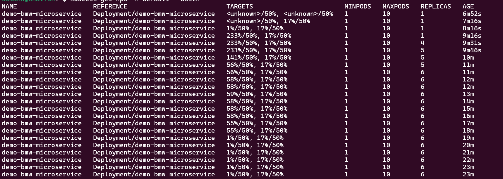
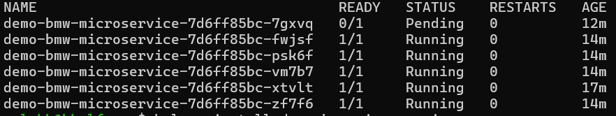

# README for Load Generation Script

## Overview

This script is a Bash script that creates a load generator to simulate HTTP requests to a Kubernetes service named `demo-microservice`. The load generator runs inside a Kubernetes cluster, using a `busybox` pod to make continuous HTTP calls to the service, enabling you to monitor and observe the scaling behavior of your horizontal pod autoscaler.

## Prerequisites

- You have `kubectl` configured and connected to your Kubernetes cluster.
- The service (`demo-microservice`) is deployed in the Kubernetes cluster.
- Kubernetes namespace where the service is running (default is `default`).

## Script Explanation

The script performs the following steps:

1. **Set Service Details:**
   - Defines the Kubernetes namespace (`NAMESPACE`) and the service name (`SERVICE_NAME`) for which the load will be generated. The default namespace is set to `default`, and the service name is `demo-microservice`.

2. **Get ClusterIP Address:**
   - Retrieves the `ClusterIP` address of the Kubernetes service using the `kubectl get svc` command. The `ClusterIP` address is needed for making HTTP requests to the service.

3. **Error Handling:**
   - Checks if the `ClusterIP` address was successfully retrieved. If not, it will exit the script with an error message.

4. **Create Load Generator Pod:**
   - Creates a pod named `busybox-load-generator` in the specified namespace using a `busybox` container. The container continuously makes HTTP requests to the service (`http://<SERVICE_IP>:<SERVICE_PORT>`) using `wget`.

5. **Wait for Pod Readiness:**
   - Waits until the `busybox-load-generator` pod is in the `Ready` state to ensure that load generation is running.

6. **Indicate Load Generation Start:**
   - Prints a message to indicate that the load generation has started and suggests monitoring the horizontal pod autoscaler.

## Usage Instructions

1. **Make the Script Executable**

   ```sh
   chmod +x load-generator.sh
   ```

2. **Run the Script**

   ```sh
   ./load-generator.sh
   ```

3. **Monitor Scaling Behavior**
   - You can use the following command to monitor the horizontal pod autoscaler:

     ```sh
     kubectl get hpa
     ```

   - This will show the current metrics and scaling activity of your autoscaler.

## Clean-Up

To remove the `busybox-load-generator` pod after you are done:

```sh
kubectl delete pod busybox-load-generator
```

## Notes

- The script uses a very small sleep duration (`0.0001 seconds`) to generate a significant amount of load. You may adjust this value to control the intensity of the load being generated.
- The pod is configured with a `restartPolicy` of `Never`, meaning it will not restart if it fails or is deleted.

## Troubleshooting

- **Could not determine ClusterIP address:** Ensure that the service `demo-microservice` is correctly deployed and accessible in the specified namespace.
- **Load Generator Pod Fails to Start:** Check the pod status using:

  ```sh
  kubectl describe pod busybox-load-generator
  ```

  This command will help you identify potential issues with the pod startup, such as image pull errors or network issues.

## Results:
```sh
kubectl get hpa -n default --watch
```


```sh
kubectl get pods
```

